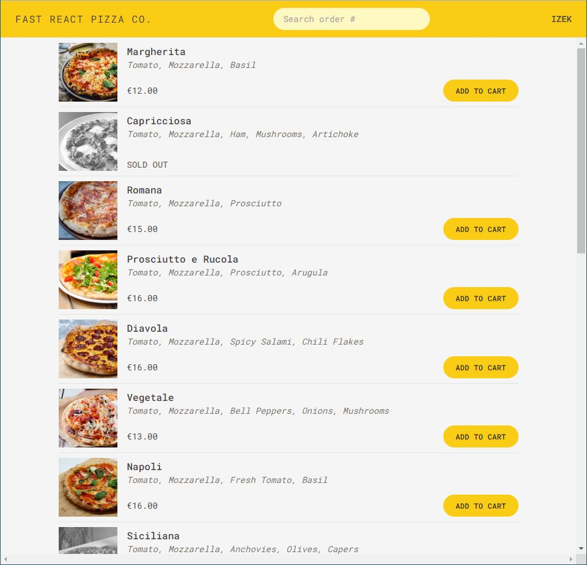

# Fast React Pizza Co.

Fast React Pizza Co. is an online ordering platform for a small pizza shop. It features a dynamic menu fetched from an API, a cart feature to hold items you want to purchase, and an ordering form complete with a geolocation feature.

It features more advanced React techniques including data fetching with React Router, Redux Toolkit / Thunks, and fetching data without navigation using useFetcher.

[Link to Application](https://fast-react-pizza-izek.vercel.app/)

---

## Credits

This application was completed as a project for [The Ultimate React Course 2023](https://www.udemy.com/course/the-ultimate-react-course/).

## Questions

For questions/concerns you can reach me on [GitHub](https://github.com/dingbat-weasel) or by Email at perk.isaac@gmail.com.
